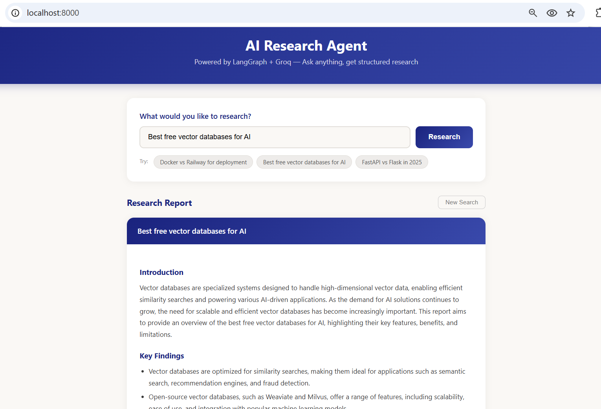
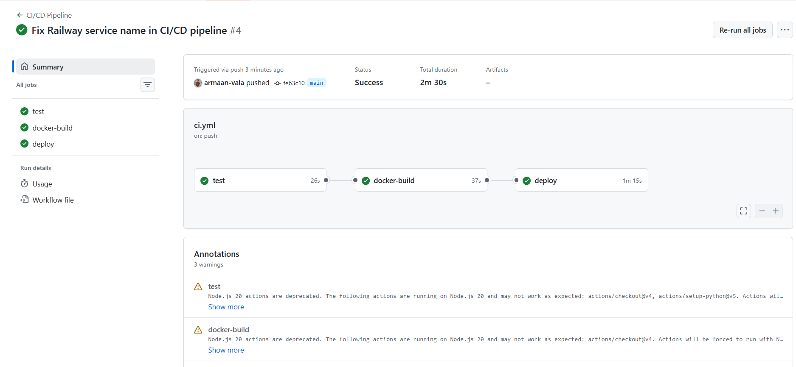

# AI Research Agent

A full-stack Agentic AI project — built, containerized with **Docker**, automated with **GitHub Actions CI/CD pipeline**, and deployed on **Railway**. Every `git push` triggers automated testing, Docker image build verification, and production deployment — zero manual steps.

The agent takes any research query, plans search strategies, fetches real-time web results, and generates a structured report with comparison tables, pros/cons, and recommendations.

**Deployed on Railway:** [agentic-ai-research-assistant-production-f060.up.railway.app](https://agentic-ai-research-assistant-production-f060.up.railway.app/)


---

## What I Built

- **Agentic AI Pipeline** — Multi-step agent workflow using LangGraph with Planner, Searcher, and Summarizer agents working in sequence
- **Dockerized the entire app** — Containerized with Docker so it runs the same everywhere, locally or in production
- **Automated CI/CD Pipeline** — GitHub Actions workflow that runs on every push: pytest tests → Docker image build + health check → deploy to Railway
- **Deployed on Railway** — Live production deployment with environment variables, health checks, and auto-redeploy on every push

```
git push  →  [ Pytest Tests ]  →  [ Docker Build + Health Check ]  →  [ Deploy to Railway ]
                  26s                        37s                            1m 15s
```

---

## Demo

### App — Research Report


### CI/CD Pipeline — All Green


---

## Tech Stack

| Layer | Technology |
|-------|-----------|
| Backend | Python, FastAPI |
| Agent Framework | LangGraph |
| LLM | Groq (Llama 3.3 70B) |
| Web Search | Tavily Search API |
| Frontend | HTML / CSS / JS |
| Containerization | Docker |
| CI/CD | GitHub Actions |
| Deployment | Railway |

---

## How to Run

### Prerequisites

- Python 3.10+
- [Groq API Key](https://console.groq.com/) (free)
- [Tavily API Key](https://tavily.com/) (free)

### Run Locally

```bash
git clone https://github.com/armaan-vala/Agentic-AI-Research-Assistant.git
cd Agentic-AI-Research-Assistant

pip install -r requirements.txt

cp .env.example .env
# Add your GROQ_API_KEY and TAVILY_API_KEY in .env

uvicorn app.main:app --reload
```

Open [http://localhost:8000](http://localhost:8000)

### Run with Docker

```bash
docker compose up --build
```

---

## Agent Flow

```
User Query  →  "Compare Docker vs Railway for deployment"
                            |
                            v
                   [ Planner Agent ]
                 Generates 2-3 targeted
                    search queries
                            |
                            v
                    [ Search Tool ]
                 Fetches real-time results
                  from web via Tavily
                            |
                            v
                 [ Summarizer Agent ]
                Produces structured report:
              Introduction → Key Findings →
           Comparison Table → Pros/Cons →
                    Recommendation
                            |
                            v
                    Final Report
```

---

## License

[Apache 2.0](LICENSE)

Built by [Armaan Vala](https://github.com/armaan-vala)
